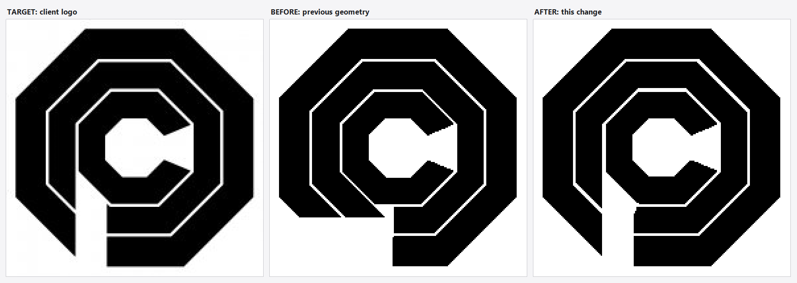

# OCP logo geometry changelog

## Summary

Client rejected fcaa868. Every revision up to it built the backwards-Q break by
*shortening* two octagon sides — a partial side-0 tip plus an inset side-1 bar,
tuned through P_STEM_EXT / P_GAP_INSET. That family of shapes cannot draw the
logo: it leaves a stubby bottom-left corner and a wedge-shaped notch, no matter
how the two fractions are tuned.

Measuring the client logo (`../ocp-2.jpg`) shows it is built the other way
round. Both outer bands are *complete* octagon rings that run straight past
their bottom-left corner and are then cut by two shared vertical lines. That
single change produces all three features the logo has and fcaa868 did not: the
long stem tapering to a point, the square-ended bottom bar, and the straight
constant-width corridor between them.

## What the logo actually measures

Reference `ocp-2.jpg`, 195x195, centre (96.67, 96.67), outer apothem 90.06 px.
Band boundaries as centre-to-flat distances, and the world radii they give with
the outer circumradius pinned at 3.20:

| Boundary | Logo (px) | Circumradius | Was |
|----------|-----------|--------------|-----|
| inner band, inner | 22.28 | 0.7917 | 0.80 |
| inner band, outer | 42.46 | 1.5087 | 1.51 |
| middle band, inner | 44.75 | 1.5900 | 1.58 |
| middle band, outer | 64.91 | 2.3064 | 2.32 |
| outer band, inner | 67.22 | 2.3885 | 2.39 |
| outer band, outer | 90.06 | 3.2000 | 3.20 |

The radii were already right to within half a pixel, so they are only nudged
onto the measured values. The notch is what changed.

## Notch geometry

Both cut lines are parallel to local side 7's flat (vertical in the logo pose)
and are absolute distances, not per-side fractions, so the middle and outer
bands share one stem line and one bar line the way the logo does.

| Piece | fcaa868 (rejected) | After |
|-------|--------------------|-------|
| Stem | side 0 shortened to P_STEM_EXT = 0.55 of the flat, cut horizontally | full side 0 kept only beyond P_STEM_CLIP = 1.4690 (44.75 px) |
| Bottom bar | side 1 started at P_GAP_INSET = 0.45 of the flat | full side 1 kept only within P_BAR_CLIP = 0.6884 (20.97 px) |
| Stem end | blunt horizontal cut, band turns the corner | tapers to a point where the diagonal meets the stem line |
| Corridor | wedge, widening outward | straight, constant 0.781 (23.8 px) |

P_STEM_CLIP is the middle band's own inner apothem, which is why that band's
inner edge reads as one unbroken straight line from the left flat down to the
stem tip. The 225-degree ray enters ink at 63.10 px in the logo and 63.27 px in
the model, confirming the stem line independently.

## Verification

Geometry moved to `../ocp_logo_geom.h`, included by `../test.cpp` and by both
checkers in `tools/`, so there is no longer a separate offline model to drift.
That drift is exactly what made f602603 measure open offline and render sealed.

- `tools/verify_logo` diffs the rasterised logo pose against `ocp-2.jpg`:
  **4 px structural mismatch** out of 21775 ink pixels (243 px raw, the rest
  being edges landing one pixel over). The residual is the reference's own
  irregularity: its eight sides sit at apothems spanning 0.37 px.
- `tools/verify_escape` flood-fills the passage at the dot's radius: all 8
  aligned poses escape, all 56 misaligned poses stay sealed, and the logo pose
  0/5/5 stays sealed.

### Screenshots are of a binary, not of this source

2026-09-27: a screenshot came back reported as still wrong. It was a build of
fcaa868 — the fix was on disk but had never been compiled. `tools/fromshot.ps1`
lifts the logo out of a screenshot into the reference's 195x195 frame so this is
answerable without guessing:

| Screenshot compared against | Structural mismatch |
|-----------------------------|---------------------|
| `ocp-2.jpg` | 1457 px |
| fcaa868 geometry rasterised | 17 px — the player dot and antialiasing |

Read the second row first: the screenshot *is* fcaa868. Rebuild before judging a
shape change, and re-run `fromshot.ps1` before assuming a screenshot disagrees
with the source.

## Intentionally unchanged

- Door rule is still "all three sides equal". The corridor runs parallel to
  side 7's flat rather than straight out from the centre, so the escape route is
  a dogleg through the C opening and then along the corridor; `verify_escape`
  confirms the dot fits through that turn in all 8 aligned poses.
- Inner C band: still a plain octagon ring minus local side 0, with radial cut
  ends. Measured against the logo, that was already exact.
- Logo pose sides 0 / 5 / 5, discrete 45-degree rotation, band:gap ratio,
  collision via the same polygons the visuals use.
- The door highlight now traces the real corridor instead of an angular wedge,
  since the passage is no longer radial.
